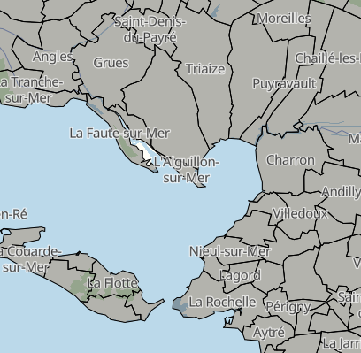

# OSM Adminstrative Area

A Mapbox GL Style Adminstrative Area map build on OpenStreetMap and [OpenMapTiles](https://github.com/openmaptiles/openmaptiles).

## Preview



## OpenMapTiles Data Layer

This style require the extra layers from [openmaptiles-layer-boundary_polygon](https://github.com/makina-maps/openmaptiles-layer-boundary_polygon).

## Edit the Style

Use the [Maputnik CLI](http://openmaptiles.org/docs/style/maputnik/) to edit and develop the style.
After you've started Maputnik open the editor on `localhost:8000`.

```
maputnik --watch --file style.json
```
